# MCX N PLU setup and usage

**Board:** [FRDM-MCXN947](nxp.com/FRDM-MCXN947) <br>
**Categories:** Low Power <br>
**Toolchains:** MCUXpresso IDE <br>
**SDK:** 2.14.0 <br>
**Peripherals:** PLU <br>

---

#### Table of Contents

1. [Introduction](#step1)
2. [Functional Description](#step2)
3. [Module Architecture](#step3)
    1. [Look Up Table (LUT)](#step3-1)
    2. [Multiplexers](#step3-2)
    3. [Flip Flops](#step3-3)
4. [PLU Setup](#step4)
5. [Creating Logic Networks](#step5)
    1. [Basic Logic Gates](#step5-1)
    2. [Combinational Logic Example](#step5-2)
        1. [Set Up](#step5-2-1)
        2. [Adjustments](#step5-2-2)
    3. [Wakeup Interrupt Example](#step5-3)
    4. [Sequential Logic Example](#step5-4)
6. [ConfigTools enablement](#step6)
    1. [Set Up](#step6-1)
    2. [Using the "Schematic – logic gates" mode](#step6-2)
    3. [Using the “Schematic – direct LUT” mode](#step6-3)
    4. [Using the “Verilog file and Verilog text” modes](#step6-4)
7. [Conclusion](#step7)

---

### Introduction <a name="step1"></a>

The MCX N has a Programmable Logic Unit (PLU) capable of creating combinational and sequential logic circuits that operate independently of the cores. The PLU does this by preprogramming look up tables or LUTs that dictate the behavior of designated outputs for all inputs of the PLU. The features of the MCX N PLU module includes:


* An array of 26 inter-connectable, 5-input look-up table (LUT) elements.
* 4 flip-flops.
* Six primary inputs pins.
* Eight primary output pins.
* An external clock to drive the four flip-flops if a sequential network is implemented.
* Capability to generate interrupts and wakeup requests from Sleep and Deep Sleep modes.

### Functional Description <a name="step2"></a>

This application note will first explain the elements that compose the PLU module, as well as how to integrate them to achieve simple logic networks. Lastly, it will demonstrate the setup and use of this module with three example codes; A 1-bit 1 to 4 demultiplexer, a 4-bit shifter and a low power implementation of the 1 to 4 demultiplexer to exemplify its wakeup capabilities.

### Module Architecture <a name="step3"></a>

The PLU is composed of 3 main elements: Look Up Tables (LUTs), Multiplexers and Flip Flops. Look Up Tables are used to create the actual logic of the PLU’s network, while multiplexers route these logic signals to and from other LUTs, as well as the PLU’s input and output pins. Flip Flops provide a method of gating logic signals from LUT elements to a shared clock input, adding a mechanism of synchronization and delay to the logic network.

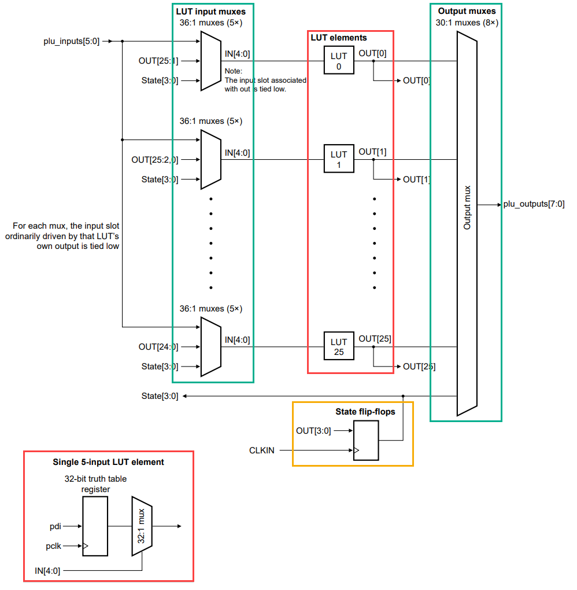

#### Look Up Table (LUT) <a name="step3-1"></a>

The PLU module has 26 inter-connectable Look Up Tables (LUTs), which can implement any combinational function with up to five inputs at once. The LUTs work by storing a pre-programmed output for every combination of inputs. This allows the look up tables to reproduce a specific output of logical 0 or 1 as soon as the input is changed without any processing required. By interconnecting LUT elements with one another, more complex programmable networks can be achieved, providing functionality of many logic gates at once.

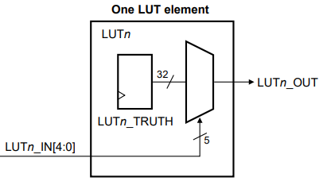

#### Multiplexers <a name="step3-2"></a>

The PLU module includes a variety of multiplexers that select the inputs and outputs for each Look Up Table (LUT) element.
Each LUT element has 5 input multiplexers that route a signal to each of its 5 inputs. The available input signals for each LUT include:

* PLU Input pads.
* Other LUT element outputs.
* State Flip Flop outputs.

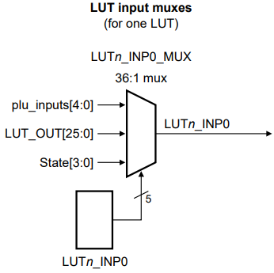

The PLU also has one output multiplexer for each PLU output pad (eight in total) that selects what Look-Up Table or Flip Flop state will drive each output pad.

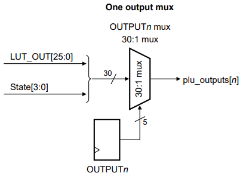

#### Flip Flops <a name="step3-3"></a>

The final PLU element is a type D flip flop that allows for retention of data, providing the means for sequential logic circuits and simple state machines.

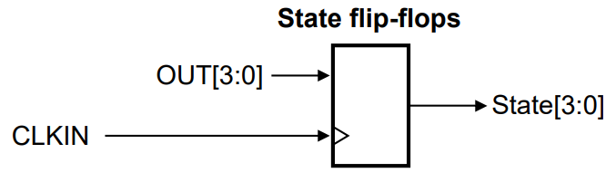

The PLU module has 4 flip flops that are connected to the outputs of LUTs[3:0] as well as the external PLU_CLKIN signal that is used for timing and synchronization between flip flops. In order to use the flip flop elements, a clock signal must be supplied via the PLU_CLKIN pad. Note that since the flip flops are directly connected to the outputs of the first 4 LUT elements, the corresponding LUT elements must be set up in order to use each Flip Flop element.

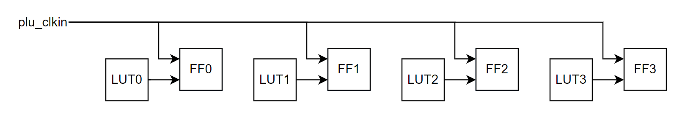

### PLU Setup <a name="step4"></a>

The following steps must be done in order to achieve a logic network on the PLU module:

1. **Enable clocks** for the PLU using the SYSCON_SYSAHBCLKCTRLx register and then toggle the PLU Reset bit from the SYSCON_PRESETCTRLx register.
2. **Assign pins** using the PORTx_PCRn registers.
3. **Create logic network** using the following steps:
    1. Write the logic behavior in the truth table register for each of the LUT elements that will be used.
    2. Program the input multiplexer registers to select the source of up to five inputs presented to each LUT.
    3. Program the output multiplexer register to select up to eight primary outputs from the PLU module.
4. *(Optional)* **Set the wakeup behavior** by using the WAKEINT_CTRL register to select the outputs to be used as wakeup sources, as well as setting a deglitching method.

### Creating Logic Networks <a name="step5"></a>

#### Basic Logic Gates <a name="step5-1"></a>

With a simple configuration of two inputs and one output on a single LUT element, all of the basic logic gates can be achieved. This would be achieved, for example, using a configuration of PLU_IN0 and PLU_IN1 pads as inputs and PLU_OUT0 pad as output for LUT0.

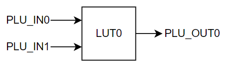

The first step of creating any logic network is to understand the truth table of the desired logic circuit. For a single AND gate using the previous configuration, the truth table would equate to the following:

|*#*| | PLU_IN1 | PLU_IN0 | PLU_OUT0 |
|---|-|:-------:|:-------:|:--------:|
|*0*| | 0       | 0       | **0**    |
|*1*| | 0       | 1       | **0**    |
|*2*| | 1       | 0       | **0**    |
|*3*| | 1       | 1       | **1**    |

The LUT would have to be set up in a way were the output is HIGH only when PLU_IN1 and PLU_IN0 are both HIGH, which is coincidentally the third combination of the LUT inputs for the previous truth table. Therefore, we need to program the LUT to output HIGH for combination #3. We can program this logic gate by writing a '1' on bit number 3 of the LUT’s truth table register. This way, when both LUT0 inputs are HIGH, the LUT element will “look up and find” a ‘1’, so it will output HIGH. On the other hand, for every other combination it will find a ‘0’ and output LOW.

| Combination #<br>*(Input)* | Truth table register<br>*(Output)* |
|:--------------------------:|:----------------------------------:|
| **0** *(0b00)*             | **0**                              |
| **1** *(0b01)*             | **0**                              |
| **2** *(0b10)*             | **0**                              |
| **3** *(0b11)*             | **1**                              |

Taking this into account, it is easy to see that all the LUT element does is "look up" each combination of inputs on a predefined table to know what logic to output. This table is programmed via the 32 bit LUTa_TRUTH register for each LUT element. The 32 bit value required for the previous logic gate expressed in hexadecimal would then be as follows:

| AND Gate        |       |       |       |       |   |          |
|-----------------|:-----:|:-----:|:-----:|:-----:|:-:|:--------:|
| LUT inputs[1:0] | 11    | 10    | 01    | 00    |   |          |
| **LUT0_TRUTH**  | **1** | **0** | **0** | **0** | → | **0x08** |

And, for the rest of the basic logic gates:

| OR Gate         |       |       |       |       |   |          |
|-----------------|:-----:|:-----:|:-----:|:-----:|:-:|:--------:|
| LUT inputs[1:0] | 11    | 10    | 01    | 00    |   |          |
| **LUT0_TRUTH**  | **1** | **1** | **1** | **0** | → | **0x0E** |

<br>

| XOR Gate        |       |       |       |       |   |          |
|-----------------|:-----:|:-----:|:-----:|:-----:|:-:|:--------:|
| LUT inputs[1:0] | 11    | 10    | 01    | 00    |   |          |
| **LUT0_TRUTH**  | **0** | **1** | **1** | **0** | → | **0x06** |

<br>

| NAND Gate       |       |       |       |       |   |          |
|-----------------|:-----:|:-----:|:-----:|:-----:|:-:|:--------:|
| LUT inputs[1:0] | 11    | 10    | 01    | 00    |   |          |
| **LUT0_TRUTH**  | **0** | **1** | **1** | **1** | → | **0x07** |

<br>

| NOR Gate        |       |       |       |       |   |          |
|-----------------|:-----:|:-----:|:-----:|:-----:|:-:|:--------:|
| LUT inputs[1:0] | 11    | 10    | 01    | 00    |   |          |
| **LUT0_TRUTH**  | **0** | **0** | **0** | **1** | → | **0x01** |

<br>

| XNOR Gate       |       |       |       |       |   |          |
|-----------------|:-----:|:-----:|:-----:|:-----:|:-:|:--------:|
| LUT inputs[1:0] | 11    | 10    | 01    | 00    |   |          |
| **LUT0_TRUTH**  | **1** | **0** | **0** | **1** | → | **0x09** |

<br>

| NOT Gate        |       |       |   |          |
|-----------------|:-----:|:-----:|:-:|:--------:|
| LUT inputs[1:0] | 1     | 0     |   |          |
| **LUT0_TRUTH**  | **0** | **1** | → | **0x01** |

<br>

| Buffer Gate     |       |       |   |          |
|-----------------|:-----:|:-----:|:-:|:--------:|
| LUT inputs[1:0] | 1     | 0     |   |          |
| **LUT0_TRUTH**  | **1** | **0** | → | **0x02** |

Note that the truth table value for a NOR gate and a NOT gate is the same in this case, as both require an output of ‘1’ for the first combination of inputs and ‘0’ for the rest. This demonstrates how the PLU does not actually create an array of logic gates but rather, simply outputs predefined values from a table of all possible combinations of inputs.

The previous tables show the register values to achieve all of the basic logic gates with the previous setup of LUT0. However, in order to achieve this configuration with input pins PLU_IN0 and PLU_IN1 as well as output pin PLU_OUT0, the multiplexers would have to be set up in the following manner:

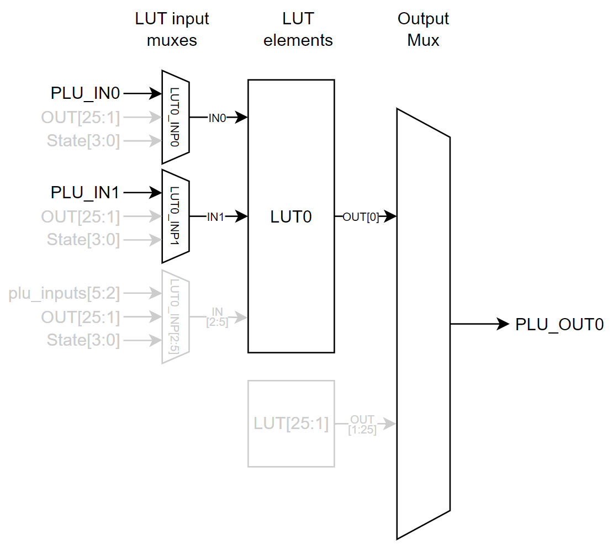

In order to achieve this, pin PLU_IN0 must be routed as input[0] of LUT0 and PLU_IN1 as input[1] of LUT0. Additionally, the output of LUT0 will be routed to the PLU_OUT0 pad. This configuration to set up both input sources, route the output source and write the truth table register to result in an AND gate can be achieved with the following code:
```c
/* Select input pin PLU_IN0 as LUT Input 0 (Input MUX0) for LUT0 on module PLU0 */
PLU_SetLutInputSource(PLU0, kPLU_LUT_0, kPLU_LUT_IN_0, kPLU_LUT_IN_SRC_PLU_IN_0);

/* Select input pin PLU_IN1 as LUT Input 1 (Input MUX1) for LUT0 on module PLU0 */
PLU_SetLutInputSource(PLU0, kPLU_LUT_0, kPLU_LUT_IN_1, kPLU_LUT_IN_SRC_PLU_IN_1);

/* Set Truth Table 0x08 for LUT element 0 on module PLU0 */
PLU_SetLutTruthTable(PLU0, kPLU_LUT_0, 0x08); // This will result in an AND gate

/* Select LUT0 output as driver for PLU_OUT0 pin on module PLU0 */
PLU_SetOutputSource(PLU0, kPLU_OUTPUT_0, kPLU_OUT_SRC_LUT_0);
```

#### Combinational Logic Example <a name="step5-2"></a>

##### Set Up <a name="step5-2-1"></a>

A simple but useful example of a combinational logic circuit is a demultiplexer. This circuit outputs a single input data to one of many selectable outputs at once. The truth table for a specific example of this circuit is shown on the following table:

|   Comb #   |   | D |  S1  |  S0  |   |  Y3  |  Y2  |  Y1  |  Y0  |
|:----------:|:-:|:-:|:----:|:----:|:-:|:----:|:----:|:----:|:----:|
|    0 → 3   |   | 0 |  x   |  x   |   |  0   |  0   |  0   |  0   |
|      4     |   | 1 |  0   |  0   |   |  0   |  0   |  0   |  1   |
|      5     |   | 1 |  0   |  1   |   |  0   |  0   |  1   |  0   |
|      6     |   | 1 |  1   |  0   |   |  0   |  1   |  0   |  0   |
|      7     |   | 1 |  1   |  1   |   |  1   |  0   |  0   |  0   |

Note that the fact that S1 and S2 are labeled as "Don’t Care" when D = '0' means that the first 4 combination numbers (from 0 to 3) all result in the same output of all LOW outputs.

With the truth table defined, the assignment of pins can be done as follows:

* PLU_IN2 corresponds to Data line (D).
* PLU_IN1 corresponds to Select line 1 (S1).
* PLU_IN0 corresponds to Select line 0 (S0).

The fact that there are 4 outputs for this truth table also means that the PLU will require 4 LUTs, as each LUT can only generate one output. Therefore the truth table values for each of the LUT registers are defined as follows (where the value between parenthesis corresponds to the logic value on the Data line):

|  |  | PLU_IN[2:0] | (1)11 | (1)10 | (1)01 | (1)00 | (0)11 | (0)10 | (0)01 | (0)00 |  |  |
|:---:|:---:|:---:|:---:|:---:|:---:|:---:|:---:|:---:|:---:|:---:|:---:|:---:|
| LUT0_TRUTH | → | PLU_OUT0 | 0 | 0 | 0 | **(1)** | 0 | 0 | 0 | **(0)** | → | **0x10** |
| LUT1_TRUTH | → | PLU_OUT1 | 0 | 0 | **(1)** | 0 | 0 | 0 | **(0)** | 0 | → | **0x20** |
| LUT2_TRUTH | → | PLU_OUT2 | 0 | **(1)** | 0 | 0 | 0 | **(0)** | 0 | 0 | → | **0x40** |
| LUT3_TRUTH | → | PLU_OUT3 | **(1)** | 0 | 0 | 0 | **(0)** | 0 | 0 | 0 | → | **0x80** |

Note that, since PLU_IN2 or “Data” remains FALSE for the first 4 combinations (i.e. 000, 001, 010 and 011) all of the outputs are logic '0'. This corresponds to the first 4 combinations of the truth table with "Don’t Care" for the select lines as mentioned previously.

The setup for this combinational circuit, including these values of LUTs for each PLU_OUTx signal can be found on the "frdmmcxn947_plu_4to1_demux" example code attached.

This example is based on the [FRDM-MCXN947](nxp.com/FRDM-MCXN947) Board. The input and output pads are as follows:

* Inputs:
    * Select 0 → P1_10 (PLU_IN0). *(Note: if using Rev. B, SJ16 need to be changed to position 2-3)*
    * Select 1 → P1_11 (PLU_IN1). *(Note: if using Rev. B, SJ26 need to be changed to position 2-3)*
    * Data → P1_14 (PLU_IN2).

* Outputs:
    * Y0 → P1_8 (PLU_OUT0).
    * Y1 → P1_9 (PLU_OUT1).
    * Y2 → P1_12 (PLU_OUT2).
    * Y3 → P1_13 (PLU_OUT3).

When connecting the inputs to either VDD or GND, the outputs will change according to the previous truth tables, which can be seen on an oscilloscope or logic analyzer. The following image shows the output results of all the permutations of the three inputs.

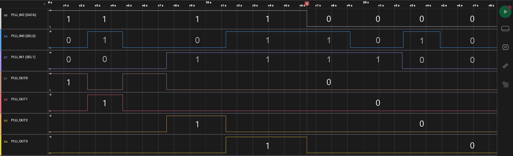

As seen on the previous image, the value of PLU_IN2(DATA) is routed or demuxed into only one output at a time. When Data is ‘1’, this value is transmitted to whichever output is selected by the values of PLU_IN0 (SEL0) and PLU_IN1 (SEL1), and when Data is ‘0’, all outputs will result in ‘0’.

##### Adjustments <a name="step5-2-2"></a>

But what if adjustments had to be done in order to change the routing of the input signals? For example, PLU_IN0 should now be the Data line and PLU_IN2 and PLU_IN1 should be Select 1 and Select 0 respectively. There would be three ways of approaching this:

1. Reconnect the external input signals to the pads according to the new requirements:
    * Data → P1_10 (PLU_IN0).
    * Select 0 → P1_11 (PLU_IN1).
    * Select 1 → P1_14 (PLU_IN2).

2.	Change the input multiplexers for all 4 LUT’s by selecting the following input sources when setting up the PLU_SetLutInputSource() functions:
    * Change LUTx input IN0 (S0) from PLU_IN0 to PLU_IN1.
    * Change LUTx input IN1 (S1) from PLU_IN1 to PLU_IN2.
    * Change LUTx input IN2 (D) from PLU_IN2 to PLU_IN0.

3.	Simply change the value of the truth table registers by adjusting the LUT combinations according to the new requirements (where the value in parenthesis corresponds to the new logic value on the Data line):

|  |  | PLU_IN[2:0] | 11(1) | 11(0) | 10(1) | 10(0) | 01(1) | 01(0) | 00(1) | 00(0) |  |  |
|:---:|:---:|:---:|:---:|:---:|:---:|:---:|:---:|:---:|:---:|:---:|:---:|:---:|
| LUT0_TRUTH | → | PLU_OUT0 | 0 | 0 | 0 | 0 | 0 | 0 | **(1)** | **(0)** | → | **0x02** |
| LUT1_TRUTH | → | PLU_OUT1 | 0 | 0 | 0 | 0 | **(1)** | **(0)** | 0 | 0 | → | **0x08** |
| LUT2_TRUTH | → | PLU_OUT2 | 0 | 0 | **(1)** | **(0)** | 0 | 0 | 0 | 0 | → | **0x20** |
| LUT3_TRUTH | → | PLU_OUT3 | **(1)** | **(0)** | 0 | 0 | 0 | 0 | 0 | 0 | → | **0x80** |

With this example, it is easy to see the flexibility that the PLU module provides with the LUT elements. Although rerouting (either externally or internally with the multiplexers) the inputs is possible in order to adjust for different input requirements, by simply changing the values in the LUT registers the whole logic network can be rearranged as a whole. 

It is possible to test the previous idea by changing the "DEMO_PLU_LUT_x_TRUTH_TABLE" macros on the "frdmmcxn947_plu_4to1_demux" example code to the values shown on the previous table.

#### Wakeup Interrupt Example <a name="step5-3"></a>

The PLU also has the capability of causing interruptions which, in certain conditions, can additionally be used to wake up the MCU from low power modes. Specifically, it can be used to wake up the MCX from Sleep and Deep Sleep modes.

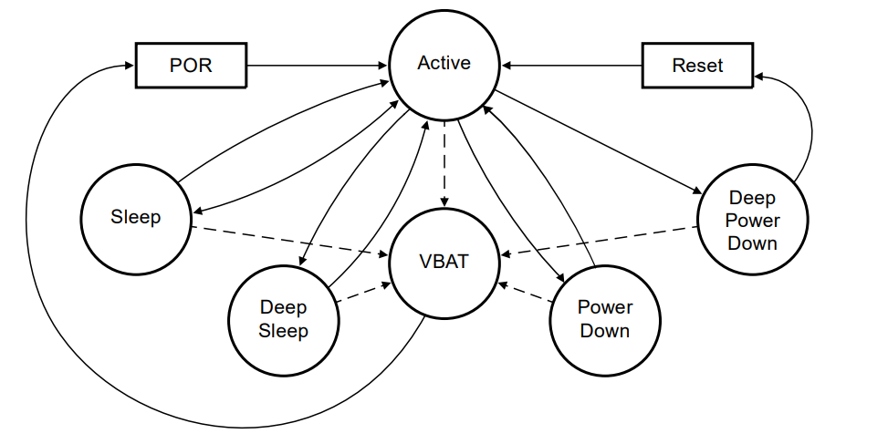

The interruption capabilities of the PLU are based on its output being set to ‘1’ or logic ‘HIGH’ and configured with the register WAKEINT_CTRL. Bits 0 to 7 of this register set up the mask for each one of the 8 outputs. This mask determines whether its respective output will contribute to the interruption request or not. For example, if “MASK” = 0b10010011, outputs 7, 4, 1 and 0 will contribute to the interruption as their bits are set to ‘1’, while outputs 6, 5, 3 and 2 will be blocked from generating an interruption as their respective mask bits are ‘0’. Note that since there is only one ISR for the PLU, all outputs are OR’ed. In the previous example, as soon as any one of the 4 masked outputs generate a ‘1’ or ‘HIGH’ output, the interrupt will be triggered. As long as all of the 4 masked outputs generate a ‘0’ or logic ‘LOW’, there will be no interruption from the PLU.

However, the output signals generated by the PLU can be prone to glitching, which in turn could generate false interrupts or wake up requests. The PLU has two methods of preventing these glitches.

First, it can use an internal clock to filter out glitches. This filter capability is enabled by using bitfield “FILTER_MODE” [9:8] of the WAKEINT_CTRL register. These bits determine the time frame that will be used to filter out possible output glitch pulses. It can be set from 1 clock period to a maximum of 3 clock periods of the selected clock source to be used as filter. This clock source is determined by the bitfield “FILTER_CLKSEL” [11:10] of the same register, which selects either the 1MHz low-power oscillator or the 12MHz FRO as reference clocks for the filter. To give an example, if “FILTER_MODE” = 11b and “FILTER_CLKSEL” = 01b, the PLU will filter out pulses shorter than 3 clock periods of the 12MHz FRO, or approximately 0.25 μs.

The second mechanism to prevent false interruptions or wake up events is by latching the interrupt. Bitfield “LATCH_ENABLE” sets up this latching mechanism for the interruption request, which uses a registered or latched version of the interrupt request rather than the direct or filtered version from the PLU outputs. This option uses an external clock source provided to the module via the PLU_CLKIN pin to register or latch the interrupt request on the rising-edge of the PLU_CLKIN signal. Once registered, the interruption is able to trigger and must be cleared by software afterward by writing a ‘1’ on the “INTR_CLEAR” bit of the WAKEINT_CTRL register. This option provides more flexibility for setting the sampling times as it is not constrained to 1MHz or 12MHz clocks and it prevents the use of an internal clock in order to reduce power consumption on the MCX. However it does require the use of an external clock signal and the additional PLU_CLKIN pad.

Note that only one method to prevent interruption glitches can be used at once.

The setup for a combinational circuit with interruption capabilities, including the values of the WAKEINT_CTRL register to wake up the MCU from Deep Sleep mode can be found on the "frdmmcxn947_plu_4to1_demux_isr" example code attached. This code uses the latching method for deglitching.

This example is based on the [FRDM-MCXN947](nxp.com/FRDM-MCXN947) Board. The input and output pads are as follows:

* Inputs:
    * Select 0 → P1_10 (PLU_IN0). *(Note: if using Rev. B, SJ16 need to be changed to position 2-3)*
    * Select 1 → P1_11 (PLU_IN1). *(Note: if using Rev. B, SJ26 need to be changed to position 2-3)*
    * Data → P1_14 (PLU_IN2).
    * CLK → P1_6 (PLU_CLKIN).

* Outputs:
    * Y0 → P1_8 (PLU_OUT0).
    * Y1 → P1_9 (PLU_OUT1).
    * Y2 → P1_12 (PLU_OUT2).
    * Y3 → P1_13 (PLU_OUT3).
    * Blue LED → P3_3 (Sleep signal).

Just as the with the previous combinational example, when connecting the inputs to either VDD or GND, the outputs will change according to the configured demultiplexer truth table. However, now PLU_OUT0 and PLU_OUT3 also generate an interruption. In this example code, pressing SW3 will cause the MCU to enter Deep Sleep mode, and a PLU interruption will cycle the power mode back to Active.

The blue LED is used to provide a visual representation of the power state of the MCU. When the MCU is in Active mode the LED will be ON, and when in Deep Sleep the LED will be OFF.

The following is a capture of the expected behavior from this code:

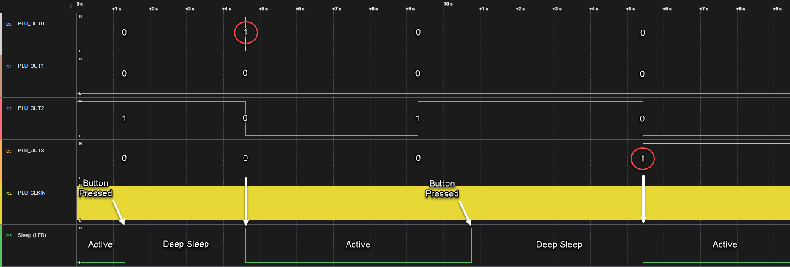

As illustrated, the SW3 button press will send the MCU to Deep Sleep, which is represented by the green line. This signal is in fact the output of P3_3 which is the pad connected to the blue LED. When LOW, the blue LED is ON and this signals the MCU is in Active mode. When HIGH, the blue LED is OFF and this signals the MCU is in Deep Sleep. However, as long as PLU_OUT2 is set, there will be no PLU output that contributes to the interrupt, since only PLU_OUT0 and PLU_OUT3 are set to cause an interruption. Therefore, the MCU will remain in Deep Sleep mode until either PLU_OUT0 or PLU_OUT3 are set. Once any of these outputs is set to ‘1’ or ‘HIGH’, the interruption occurs and cycles the MCU to Active mode once again.

The outputs that contribute to the interruption were set for this example to PLU_OUT0 and PLU_OUT3, but can easily be changed by adjusting the following definitions in ‘plu_4to1_demux_isr.c’:

```c
#define ENA_INT_PLU_OUT0 1 /* Enable PLU_OUT0 interruption */
#define ENA_INT_PLU_OUT1 0 /* Block PLU_OUT1 interruption */
#define ENA_INT_PLU_OUT2 0 /* Block PLU_OUT2 interruption */
#define ENA_INT_PLU_OUT3 1 /* Enable PLU_OUT3 interruption */
```
To ensure that the MCU is in fact cycling between Active and Deep Sleep modes with the use of the button and the PLU ISR, a current consumption measure was done with the MCU-Link Pro’s power measurement capabilities on the [FRDM-MCXN947](nxp.com/FRDM-MCXN947). To do this, jumper J24 (also labeled as IDD_MCU) and GND signals from the board were connected to J9 of the MCU-Link Pro as follows:

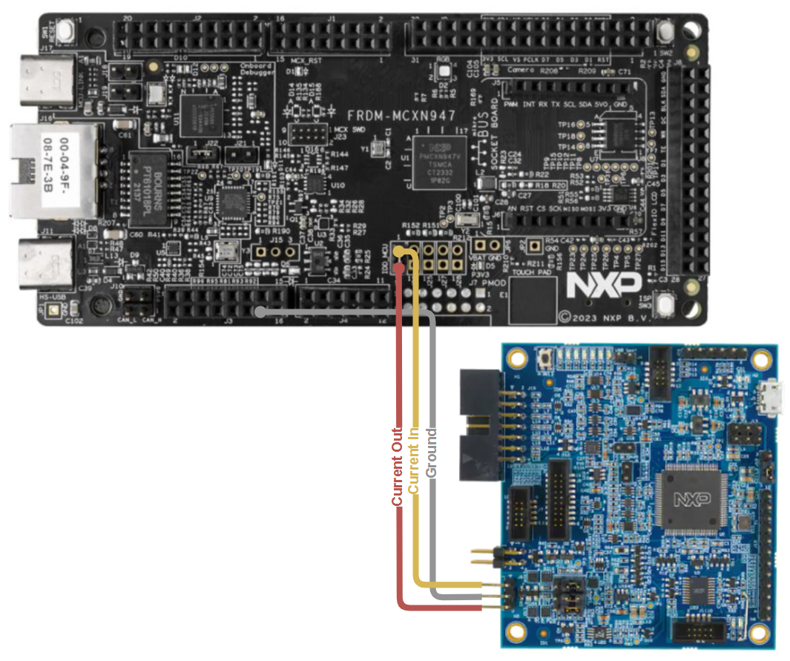

The following are the measured results:

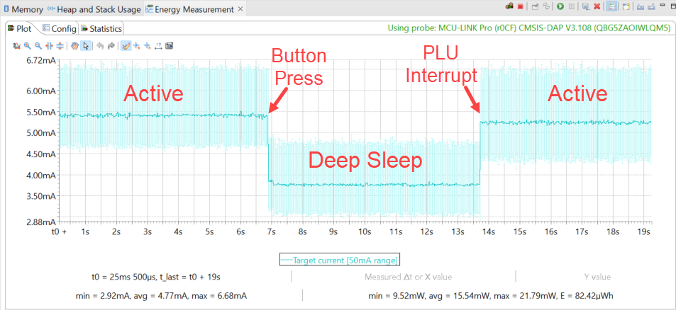

Before the SW3 button press, the MCX shows a current consumption of about 9.32mA. After pressing SW3, this current consumption drops to 7.96mA, demonstrating that the MCX enters Deep Sleep mode. Finally, after the PLU interrupt is generated by the change in PLU outputs, the current consumption goes back to 9.32mA, therefore this interruption cycled back the power mode to Active.

It is worth mentioning that the blue LED was enabled for this test for a visual confirmation of the transitions between the power modes. This LED can be disabled by setting the following macro to ‘0’ on ‘plu_4to1_demux_isr.c’:

```c
/* Enable or disable LED usage for corroborating Sleep behavior or adjusting current measurements */
#define APP_ENABLE_LED 1
```

#### Sequential Logic Example <a name="step5-4"></a>

A simple example of a sequential logic circuit is a shift register. This circuit uses a cascade of flip flops where the output of each is connected to the input of the next. In this manner, an input signal will be propagated during each clock cycle from one flip flop to the next. If there is no clock signal, the data on each flip flop element will retain its state. Considering that this circuit has both time and input dependent outputs (rather than only input dependent output as a combinational logic circuit would), it can be represented as a state machine that transitions between states depending on the input.

The state diagram for a little endian 4 bit shift register is as follows:

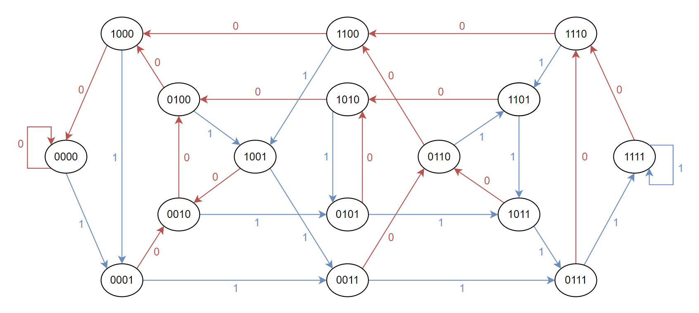

Each state is represented by the ovals and the output of each of the 4 flip flops is the value inside each state. For every transition, either a '1' (blue transition) or a '0' (red transition) is added to the LSB, depending on the input that is present on each clock cycle. If no clock cycle is present, there would be no transition and the state would be retained.
 
As mentioned before on the Flip Flop chapter, the use of the state Flip Flops and the PLU_CLKIN input signal is required in order to create a sequential logic circuit on the PLU. Considering that the inputs of the four Flip Flops are connected to the first four LUT elements as seen on the following diagram, in order to use the Flip Flops, these four LUT elements would also have to be set up. Therefore, to achieve a shifter circuit, the 4 state flip flops would need to be connected as follows:

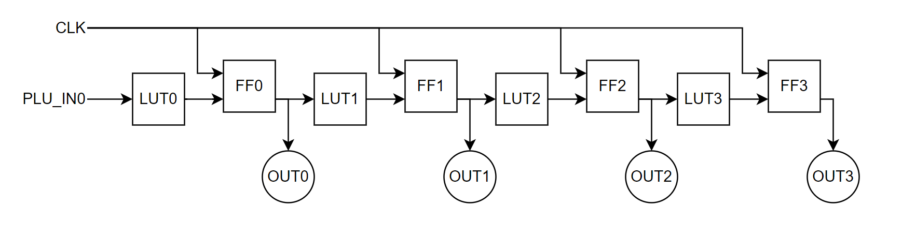

Since each of the state flip flops is connected to a corresponding LUT element, each LUT element must be used to connect the inputs of the flip flops. Therefore, using the input multiplexers of each of the LUT elements, PLU_IN0 can be connected to FlipFlop0 and the output of each flip flop to the input of each of the subsequent state flip flops. Once connected, all of the LUT elements can be set up as a simple buffer gate, where the output will be the same as the input. This is achieved by writing ‘0x2’ to the LUT's truth table register. Yet, it is easy to see how more complex state machines can be implemented when using this mix of LUT and Flip Flop elements, by having more complex combinational circuits connected to each sequential circuit.
 
The setup for this sequential circuit, including these values of the LUT buffers for each state flip flop element can be found on the "frdmmcxn947_plu_4bit_shifter" example code attached.
 
This example is based on the [FRDM-MCXN947](nxp.com/FRDM-MCXN947) board. The input and output pads are as follows:

* Inputs:
    * P3_4(GPIO) → P1_7 (PLU_CLKIN).
    * VDD or GND → P1_10(PLU_IN0). *(Note: if using Rev. B, SJ16 need to be changed to position 2-3)*
* Outputs:
    * P1_8 (PLU_OUT0).
    * P1_9 (PLU_OUT1).
    * P1_12 (PLU_OUT2).
    * P1_13 (PLU_OUT3).

P3_4 will be toggled every second, making a 1Hz clock signal and functioning as the PLU_CLK for the flip flops. On every positive edge of the clock signal, the value on PLU_IN0 will be propagated through each of the flip flops to the four first PLU_OUT pins. The following image shows this propagation of a single HIGH pulse through all of the outputs, resulting in the following transitions (0000 → 0001 → 0010 → 0100 → 1000 → 0000):

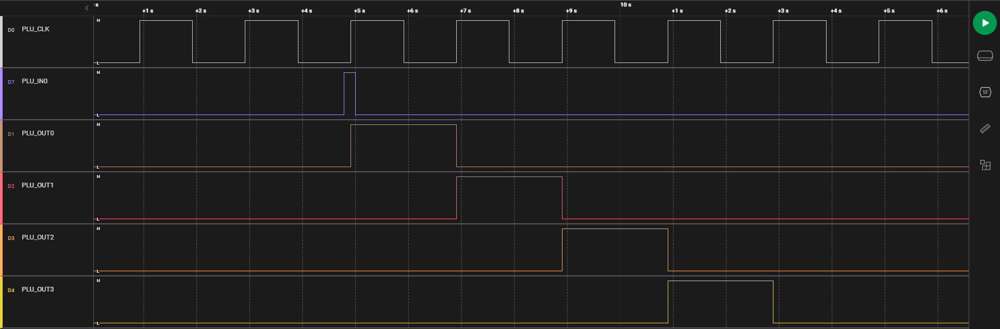

If the clock signal stops generating positive edges, the flip flops will not update their values. Instead, the current value will be stored until the next positive edge of the clock signal as shown on the following image:

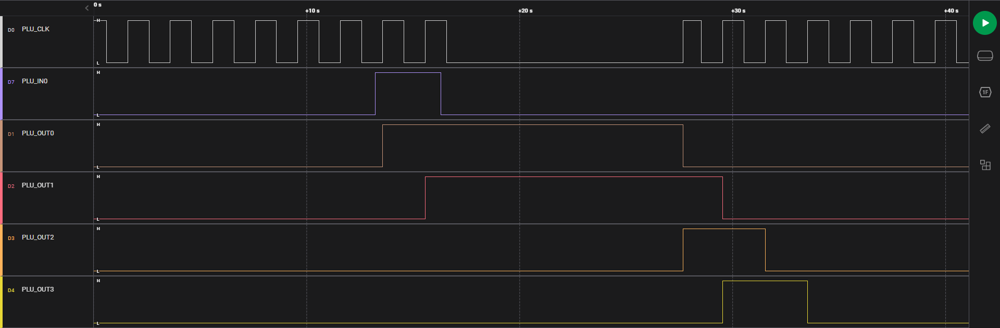

The transitions for this case were 0000 → 0001 → 0011 → 0110 → 1100 → 1000 → 0000 as the input remained high for two clock cycles. However, the transition from 0011 → 0110 was halted until the next positive edge of the clock cycle. During the halt, the value ‘0011’ was stored on the flip flops for approximately 10 seconds before resuming the shifting process.

### ConfigTools enablement <a name="#step6"></a>

#### Set Up <a name="#step6-1"></a>

The PLU is fully integrated with ConfigTools, allowing for a friendlier and method of setting up the PLU’s elements by using a digital schematic based interface, or even Verilog files. To use this, first enable the “Peripherals” Tool on Config Tools Overview window by turning on its respective toggle switch, and then open the tool by  clicking on the Peripherals icon:

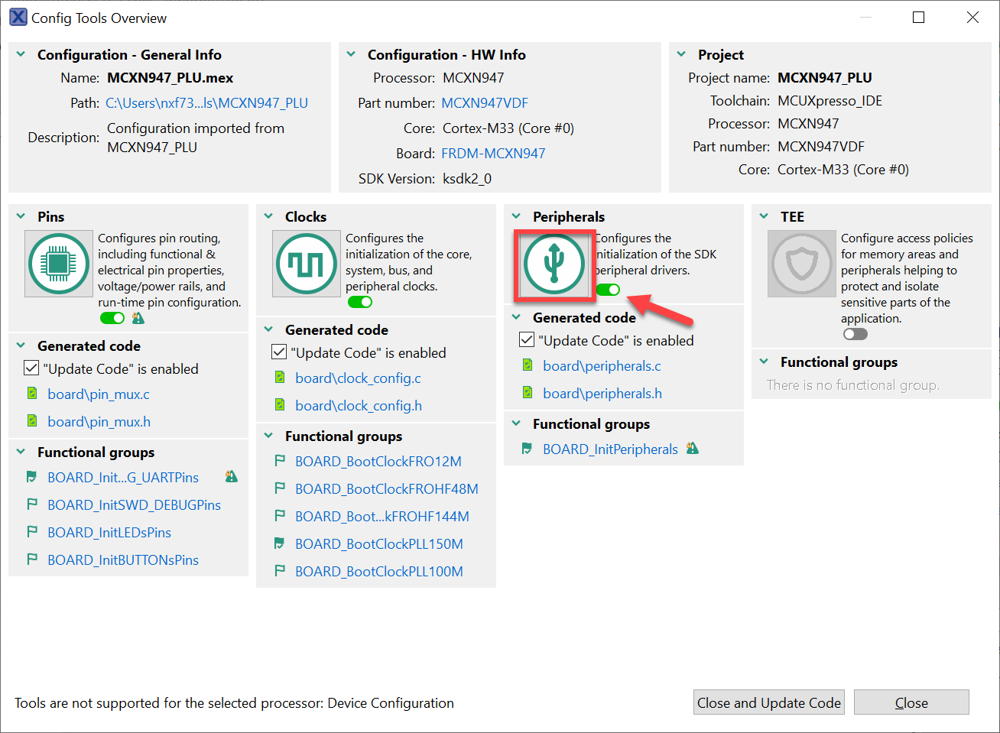

Then, on the Peripherals panel on the left hand side, search for “plu” and add enable it by clicking on the check mark box:

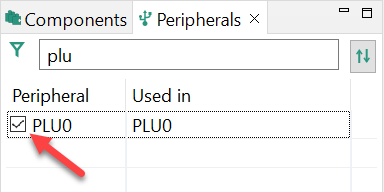

The PLU peripheral configuration will now be ready to use. By default, the general configuration will include the configurations of all of the aforementioned elements:

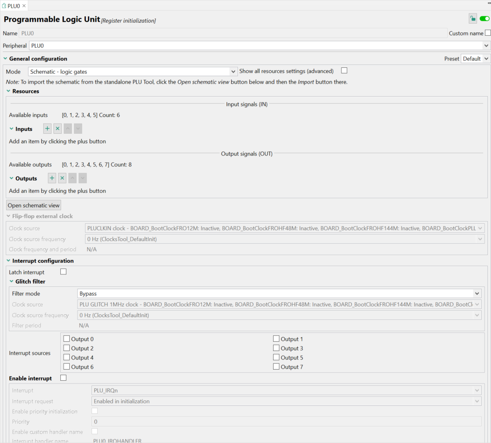

From top to bottom, it shows:
1.	Configuration Mode, which allows for different methods of configuring the PLU's elements.
2.	Resources, which allow to configure inputs, outputs and LUTs (LUTs are available to configure here when using the “Show all resources settings (advanced)” option).
3.	Flip-flop external clock configuration.
4.	Interrupt configuration, including latch and glitch filters.

The PLU's elements, including inputs, outputs, LUTs, Flip-Flops and Interruts have all been explaned in this document, so the remainder of this chapter will focus on the configuration modes for the PLU on ConfigTools.

#### Using the "Schematic – logic gates" mode <a name="#step6-2"></a>

The default configuration mode will be “Schematic – logic gates” which is the simplest method of setting up the PLU as it allows for a schematic configuration of the module using a set of predefined logic gates.

By clicking on the “Open schematic view” button, a blank canvas will appear with buttons for each of the basic logic gates:

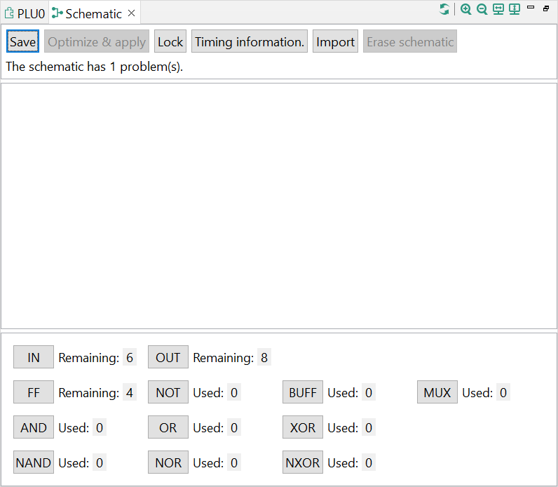

This canvas allows to easily create digital circuit schematics based on the fundamental logic gates. This mode allows for a much easier recreation all of the basic logic gates as seen on section “5.1 Basic Logic Gates” of this document, but now with an intuitive drag and drop schematic interface. We can simply add two inputs, one output and the logic gate, and click on the terminals of each to wire them correspondingly:

AND Gate:

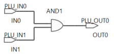

OR Gate:

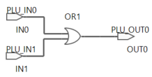

XOR Gate:

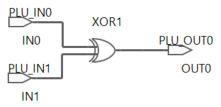

NAND Gate:

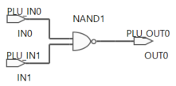

NOR Gate:

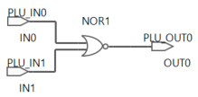

NXOR Gate:

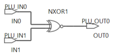

NOT Gate:

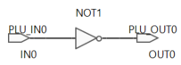

Buffer Gate:

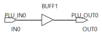

Multiplexer. (Even though not technically a basic logic gate, this mode also has a preset for a multiplexer):

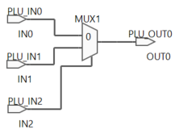

After wiring all of the inputs, outputs and gates, all that is left is to click on the “Optimize & apply” button and the tool will automatically translate the drawn schematic to the register definitions to be used by the PLU.

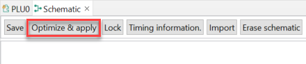

The translation to of the circuit to the appropriate MUX and LUT values will then be set, and can be corroborated on the “Registers” window, which will show the new changes highlighted in yellow. For the case of the previous AND gate circuit, this would be the resulting changes:

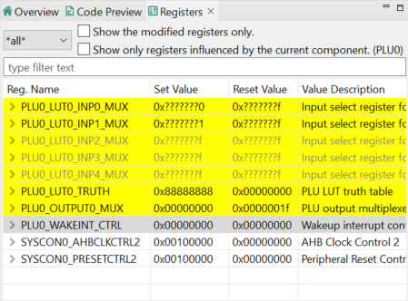

Note: The “Optimize & apply” function will also automatically Save and Lock the current schematic. If further modifications are required later, the first step includes unlocking the schematic with the “Unlock button”.

Also, by clicking on the timing information button of the top menu bar, timings for all of the PLU related signals will be shown for consideration of the user. These would be the AND gate’s timings:

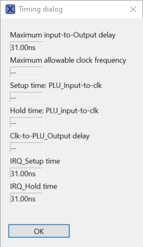

#### Using the “Schematic – direct LUT” mode <a name="#step6-3"></a>

The “Schematic – direct LUT” mode is similar to the previous mode as it is also based on a schematic drawing of the logic network. However, instead of providing predefined logic gates like in the previous mode, it shows the actual PLU elements described on section “3. Module Architecture”, these being: Inputs, Outputs, Look Up Tables and Flip-Flops. The fact that one can manually set a custom LUT on the schematic layout itself results in a configuration mode that is more direct to the actual configuration of the PLU, and therefore can be useful to create more complex or custom logic elements. For example, this mode is useful to create the 1 to 4 Demultiplexer previously elaborated in section “5.2 Combinational Logic Example” of this document. The result would be as follows:

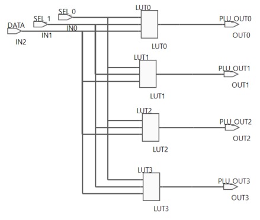

The connections of the LUT tables are labeled with capital letters in this mode, where connection A corresponds to input 0, connection B to input 1, connection C to input 2, and so on. The actual table for each element is displayed with all possible combinations of the set inputs of the LUT element. The user can then set to ‘1’ or ‘0’ the output of each of the combination, by clocking on the output column of the table. For the case of the demultiplexer, the truth tables would be set as follows (with input A as SEL_0, input B as SEL_1, input C as DATA):

LUT0 truth table:

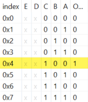

LUT1 truth table:

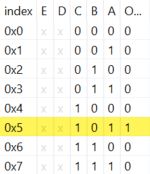

LUT2 truth table:

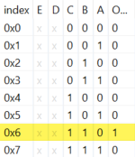

LUT3 truth table:

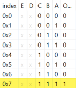

It is also worth noting that setting custom Look Up Tables is not the only way to set each LUT element. By using the “Type” drop down menu on the right of the canvas, the user can select between Custom LUT a predefined set of basic logic gates, a logic expression and a CSV file description of the logic. The “Custom” type is the default method, which allows for modification of each output individually by toggling these between ‘1’ or ‘0’. The predefined logic gates are similar to the ones seen on the “Schematic – logic gates” mode, but with the advantage of being able to increase the number of inputs of each logic gate by up to 5 inputs. In the case of MUX, 3 inputs and for Buffer and NOT gates, only 1 input:

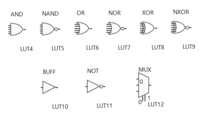

When selecting the “logic expression” type, a dialog window will appear, where the user can input the desired logic description in a text based manner, as such:

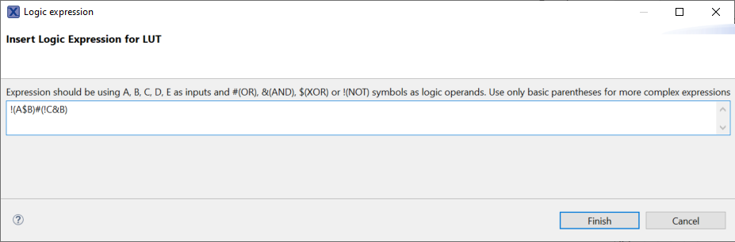

For this case, the resulting LUT assignments would be as follows:

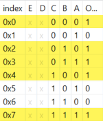

Finally, the last type of LUT setup is with the “Import CSV” method, which allows configuration of a LUT using Comma-Separated Value files. This file does require a specific format, which is as follows:

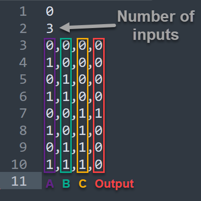

Note that the number of inputs has to be defined at the beginning of the file, before the rest of the truth table is described. Also worth noting is the fact that the order of inputs on this file is arranged as LSB first, while in the IDE the arrangment is MSB first. The resulting LUT in ConfigTools would be as follows:

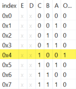

It is also worth noting that not all outputs have to be explicitly written down, only the ones resulting in a ‘1’ output. In other words, the previous table could also be reduced to the following csv file:

|   |   |   |   |
|---|---|---|---|
| 0 |   |   |   |
| 3 |   |   |   |
| 0 | 0 | 1 | 1 |


#### Using the “Verilog file and Verilog text” modes <a name="#step6-4"></a>
The final two modes allows the use of Verilog syntax to generate the logic network. These two modes are very similar between one another, the only difference being if the Verilog code will be imported as a file or it will be manually inputted to ConfigTools. Following the previous 1 to 4 demultiplexer example, this same logic network can be achieved by using the following Verilog code:

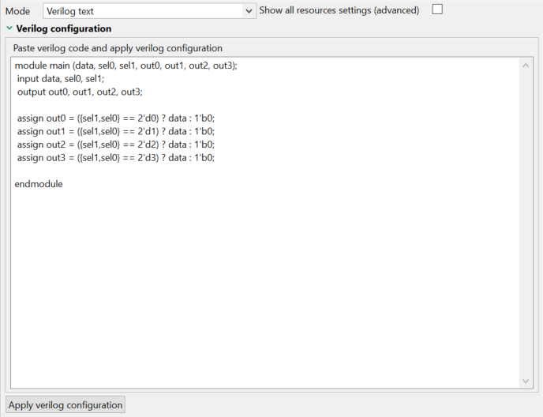

After clicking on the “Apply Verilog configuration” button, a prompt will appear to select the routing options for each of the used inputs and outputs:

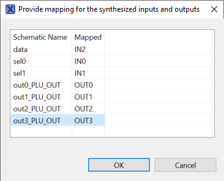

Once mapped, ConfigTools will translate the Verilog code into the necessary register definition for the PLU module to have the same behavior.

### Conclusion <a name="step7"></a>

The PLU module of the MCX N is modest when it comes to the complexity of the inner components as it is only made up from a series of look-up tables, multiplexers and flip flops. In spite of that, more elaborate and powerful logic networks can be achieved from those basic elements, providing on-chip solutions to many essential digital circuits and avoiding the need of external components for these digital applications. Not only that, but its interruption and wake up capabilities also enable the PLU to be a simple but effective addition to many low power applications. The PLU’s flexibility and built-in features enable this module to be a very effective addition to the MCX N series of MCUs that should not be overlooked.

---

#### Project Metadata
<!----- Boards ----->
[](https://github.com/search?q=org%3Anxp-appcodehub+FRDM-MCXN947+in%3Areadme&type=Repositories)

<!----- Categories ----->
[](https://github.com/search?q=org%3Anxp-appcodehub+low_power+in%3Areadme&type=Repositories)

<!----- Peripherals ----->
[](https://github.com/search?q=org%3Anxp-appcodehub+plu+in%3Areadme&type=Repositories)

<!----- Toolchains ----->
[](https://github.com/search?q=org%3Anxp-appcodehub+mcux+in%3Areadme&type=Repositories)

Questions regarding the content/correctness of this example can be entered as Issues within this GitHub repository.

>**Warning**: For more general technical questions regarding NXP Microcontrollers and the difference in expected funcionality, enter your questions on the [NXP Community Forum](https://community.nxp.com/)

[](https://www.youtube.com/@NXP_Semiconductors)
[](https://www.linkedin.com/company/nxp-semiconductors)
[](https://www.facebook.com/nxpsemi/)
[](https://twitter.com/NXP)

## 7. Release Notes<a name="step7"></a>
| Version | Description / Update                           | Date                        |
|:-------:|------------------------------------------------|----------------------------:|
| 1.0     | Initial release on Application Code Hub        | January 4<sup>th</sup> 2024 |